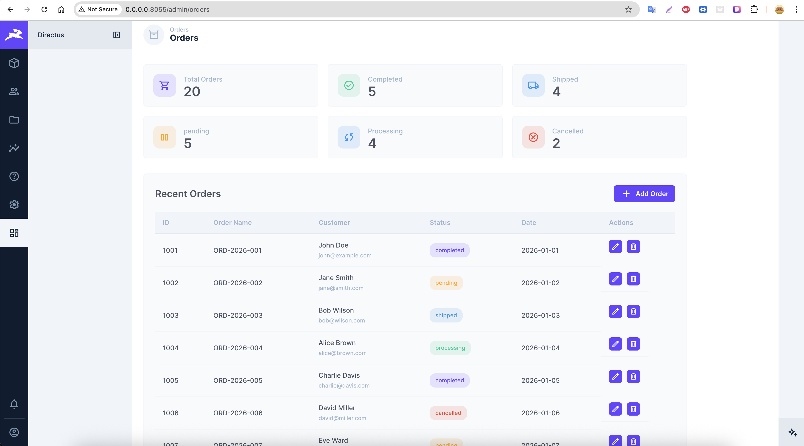
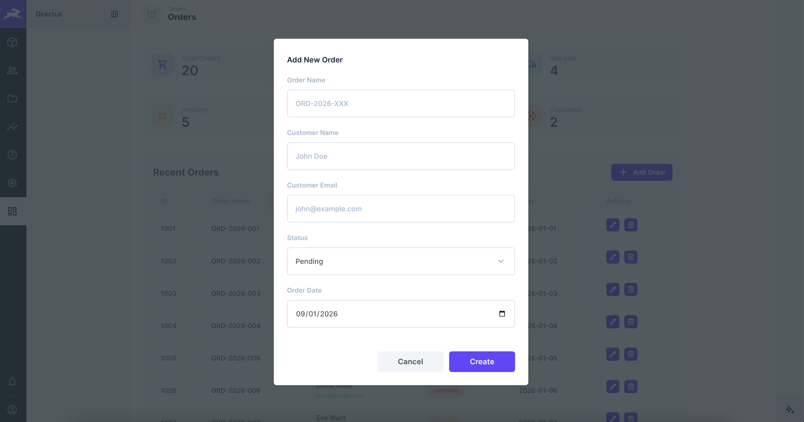
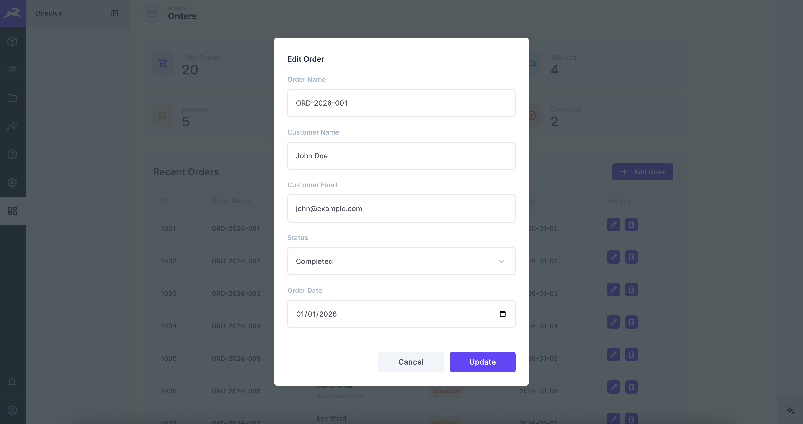

# Directus Orders Module Extension

## What it does

A custom administrative dashboard for Directus to manage order data. It features real-time stats, a searchable orders table, and a dedicated modal system for creating, editing, and deleting records.

## Why it's useful

- **Focused Workflow:** A cleaner interface optimized for order management.
- **Live Metrics:** Instant visibility into key order and user statistics.
- **Modern UX:** Smooth, responsive Vue 3 components and modals.
- **SDK-Ready:** Built with the Directus SDK for easy integration and scaling.

## Screenshots

<p align="center">
  
</p>

<p align="center">
  
</p>

<p align="center">
  
</p>

## How to install/use it

### Installation

1.  **Clone or copy** this extension into your Directus project's `extensions` directory.
2.  Navigate to the extension folder:
    ```bash
    cd directus-extension-module
    ```
3.  **Install dependencies**:
    ```bash
    npm install
    ```
4.  **Build the extension**:
    ```bash
    npm run build
    ```
5.  **Start Directus**:
    ```bash
    npx directus start
    ```

### Usage

- After building and starting Directus, the module will be available at: `http://localhost:8055/admin/orders`
- Log in to your Directus Admin Studio.
- Click on the **"Orders"** icon in the primary sidebar or navigate directly to the link above.
- Use the dashboard to monitor stats and manage your order records.

### Development

To run the extension in development mode with hot-reloading:

```bash
npm run dev
```
